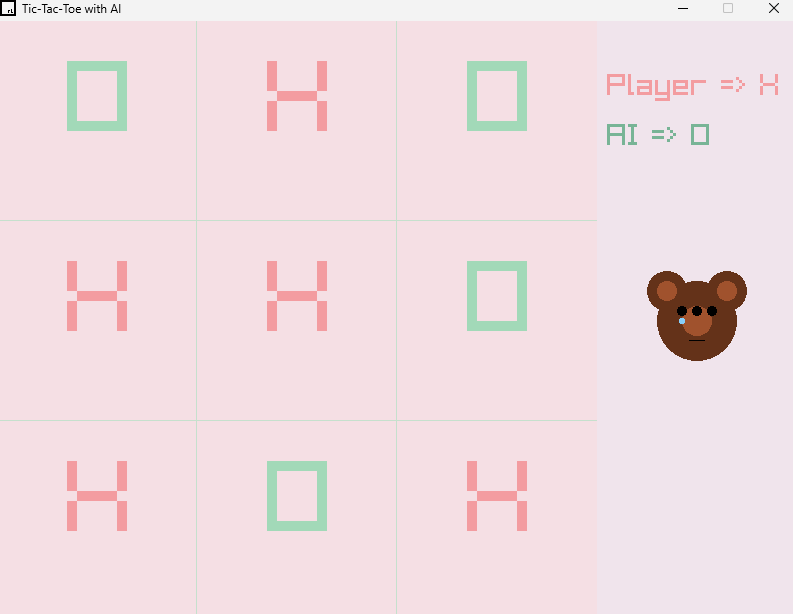
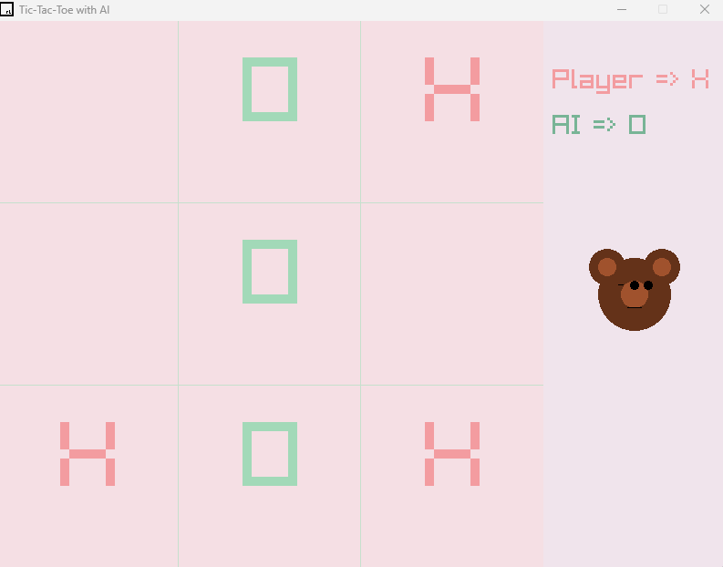

# Tic-Tac-Toe with AI 🎮🌸

 
  

  A classic Tic-Tac-Toe game with an unbeatable AI powered by the Minimax algorithm with Alpha-Beta Pruning.
  Built in C++ using Raylib for interactive graphics, 
  this project combines smart gameplay and aesthetic design to create an engaging and fun user experience.

---

## Features

- **Minimax Algorithm with Alpha-Beta Pruning** 🩷
  - The AI always makes the best possible move, ensuring a challenging and fun game for the player.
  - Handles ties and all edge cases, providing a seamless gameplay experience without unexpected results.
  
- **Modern Visuals** 🩷
  - Background that smoothly transitions between calming pastel colors, creating a relaxing atmosphere.
  - Glowing gridlines that add a touch of elegance to the classic Tic-Tac-Toe layout.
  - Dynamic hover effects on the grid to enhance interactivity and make the game feel responsive.

- **Gameplay Features** 🩷
  - Automatic game reset after each round with a clear display of the result.
  - Fun and interactive UI feedback that changes based on the outcome (win, loss, or draw).
  - Smooth animations for transitions between different states, such as player moves, AI moves, and game resets.

- **Beginner-Friendly Code** 🩷
  - A simple modular structure designed for easy understanding and customization. Perfect for those who wish to learn how to create games with AI and graphics programming.

---

##  Description

This project demonstrates the following:

- **Game AI Design** 🩷
  - The implementation of a smart AI using the **Minimax algorithm** with **Alpha-Beta Pruning**. This allows the AI to analyze possible game outcomes and make the optimal move, ensuring that the player will always face a worthy opponent.
  - The AI's ability to handle all game scenarios—wins, losses, and draws—provides a highly interactive and intelligent opponent.

- **Graphics Programming** 🩷
  - **Raylib** is used to handle graphics and user interface (UI) elements. The intuitive graphics programming provided by Raylib makes it easy to create beautiful and responsive visual effects.
  - The game board has been designed to ensure smooth visual feedback, such as highlighting the selected cells during gameplay and displaying results at the end of each game.

- **Algorithm Optimization** 🩷
  - The Minimax algorithm is optimized with **Alpha-Beta Pruning** to increase efficiency by eliminating branches of the game tree that do not need to be explored. This ensures the AI makes decisions quickly, even in more complex game states.

- **C++ Concepts** 🩷
  - The project covers a variety of key C++ concepts, including arrays, functions, control structures, and logical flow.
  - It provides a great starting point for anyone looking to understand game AI, algorithms, and interactive programming.

---
## Game Screenshots

---

## Group Members

- **Fatima Khan** 
- **Rania Imran** 
- **Laiba Aminani** 
- **Javeria Ziad** 

---

## 📚 Resources And Guidance Used

- [Raylib Documentation](https://www.raylib.com/): A comprehensive guide to using Raylib for graphics programming and game development.
- **Minimax Algorithm Tutorials** 🩷: These tutorials provided essential insights into creating optimal decision-making algorithms for games.
- **General Inspiration** 🩷: Classic games and modern UI principles inspired the game's design and flow, ensuring that the user experience is both enjoyable and user-friendly.
- **Dr Murk Marvi** 🩷:  DSAA Lecturer @ NEDUET Karachi
---

 

